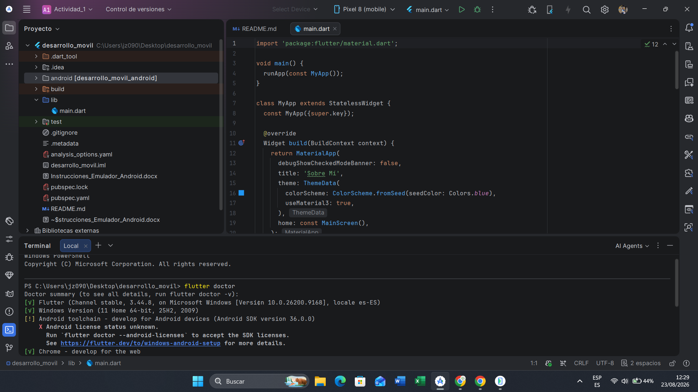
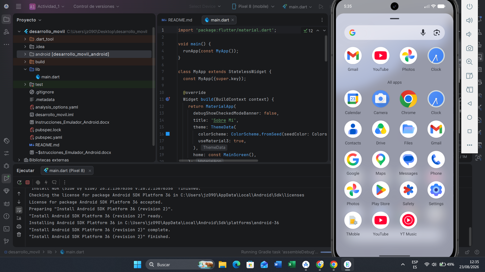

# Actividad 1

## Descripción
Esta es la primera actividad del curso de desarrollo móvil con Flutter.

## Paso a Paso
- Instalar Flutter en tu máquina siguiendo la guía oficial: [Flutter Installation](https://flutter.dev/docs/get-started/install)
- Configurar tu editor de código preferido (VS Code, Android Studio, etc.)
- Crear un nuevo proyecto Flutter usando el comando:
```bash
flutter create "desarrollo_movil"
```
- Navegar al directorio del proyecto:
```bash
cd "desarrollo_movil"
```
- Verificar que Flutter esté correctamente instalado y configurado ejecutando:
```bash
flutter doctor
```


Nota: Asegúrate de que todos los elementos estén marcados con un check verde. Si hay algún problema, sigue las instrucciones proporcionadas por `flutter doctor` para solucionarlo.

En mi caso tuve que reinstalar el NDK de Anroid Studio y reiniciar la computadora para que el check de Android Studio apareciera en verde.

- Ejecutar la aplicación en un emulador o dispositivo físico:
```bash
flutter run
``` 

